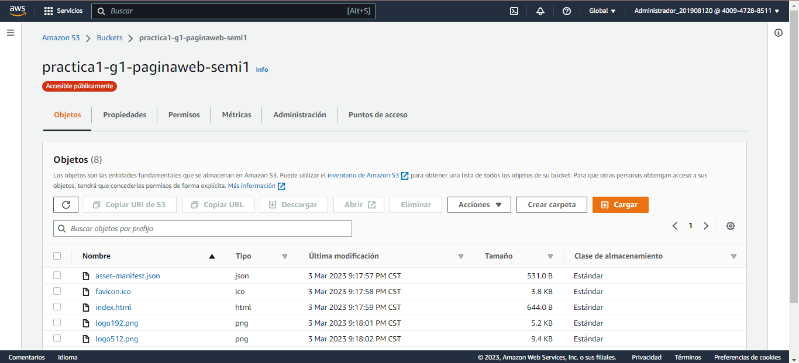
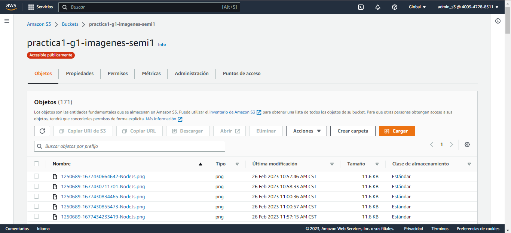
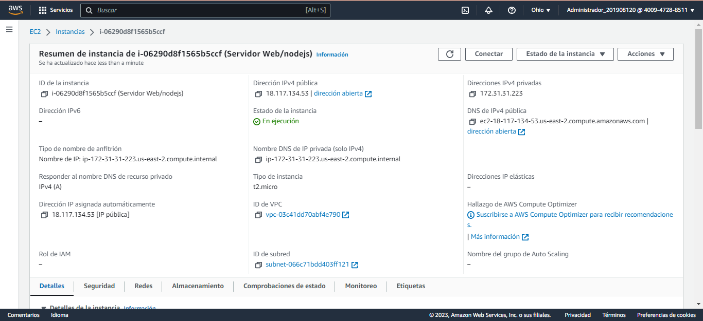
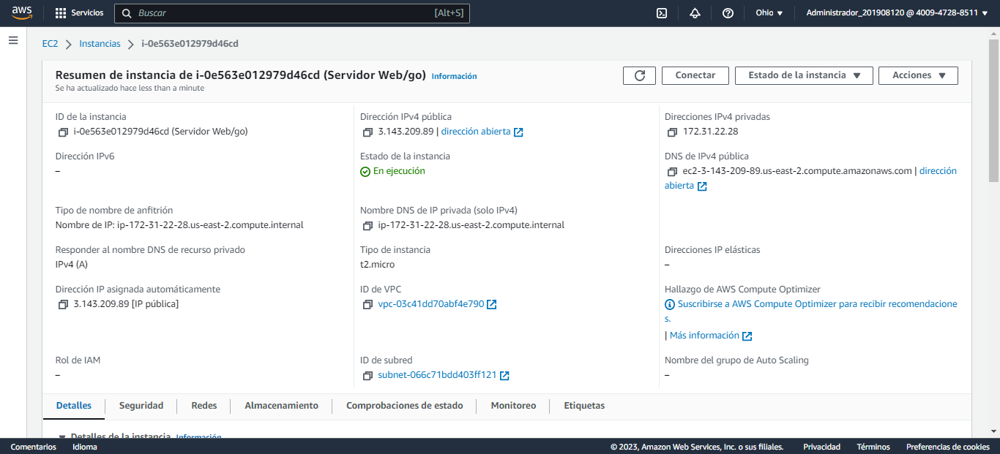
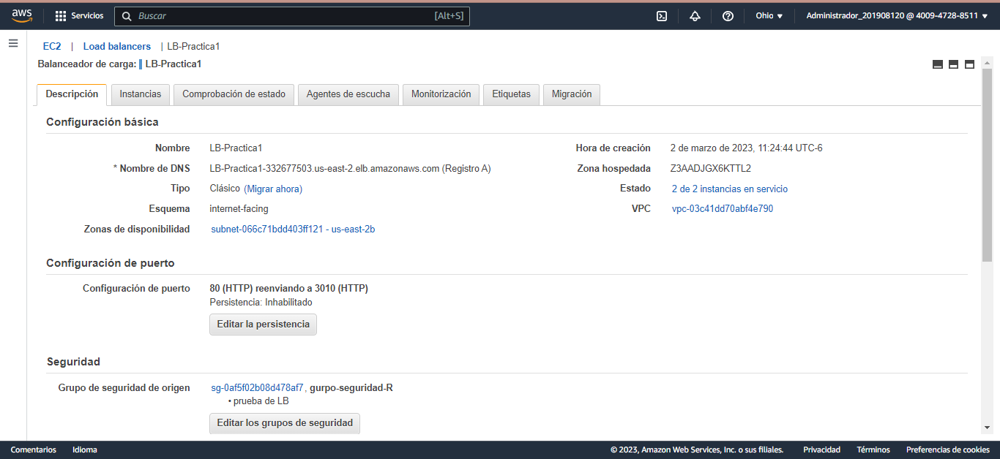
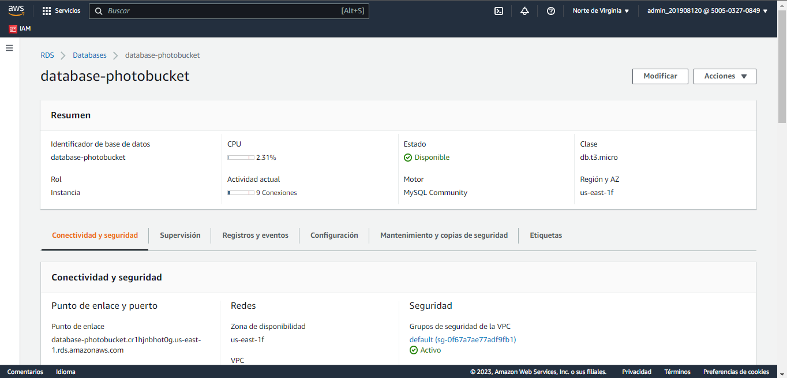
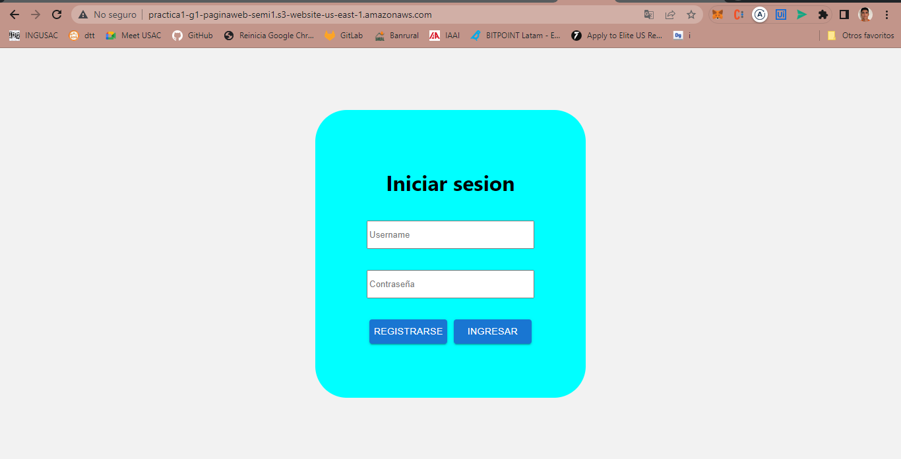

# -SEMI1-Practica1-G1
Aplicación web similar a una aplicación para almacenamiento de fotos, esta permitirá subir todo tipo de fotos.

## Integrantes

| Nombre                       | Carné     |
|------------------------------|-----------|
| Marvin Eduardo Catalán Véliz | 201905554 |
| Sara Paulina Medrano Cojulún | 201908053 |
| Julio José Orellana Ruíz     | 201908120 |
| José Adrian Aguilar Sánchez  | 201901704 |

## Descripcion de la arquitectura que utilizaron
La arquitectura está diseñada para manejar cargas de trabajo de alta demanda y escalabilidad en AWS. Un balanceador de carga distribuye la carga de tráfico entrante entre las instancias EC2 en varias zonas de disponibilidad para garantizar la alta disponibilidad del sistema y se configura por la falla de cualquier instancia. Las instancias EC2 se utilizan para ejecutar los servidores y almacenar datos en el servicio S3 altamente escalable y duradero. se utilizaron dos Bucket de S3. Un bucket es de imagenes para almacenar todas las cargas de imagnes que se hagan mediande la pagina web, El otro bucket es el que almacena la pagina web dinamica. Además, la base de datos RDS se utiliza para almacenar datos estructurados y se conecta a las instancias EC2 para proporcionar un almacenamiento de datos confiable y escalable. Esta arquitectura asegura que los servicios sean altamente disponibles, escalables y seguros.

## Usuarios IAM

#### Administrador_201908120, Admin_201908120

Estos usuarios se utilizaron para crear la instancia de RDS, EC2 y el load balancer que permite crear una un solo punto de entrada el cual se va redireccionara a los dos servidores que son las instancias de EC2. 

##### Políticas:

- **AdministratorAccess**: La política de AWS AdministratorAccess es una política de seguridad que proporciona a los usuarios de AWS un acceso completo a todos los servicios y recursos de AWS. Esta política es una de las más poderosas de AWS, y solo se recomienda para usuarios altamente confiables que necesitan acceso total a todas las funciones de AWS.

#### admin_s3

##### Políticas:

- **IAMAccessAnalyzerFullAccess**: La política IAMAccessAnalyzerFullAccess es útil para los usuarios que necesitan realizar análisis de acceso en su entorno de AWS y tomar medidas para reducir los riesgos de seguridad.

- **AmazonS3FullAccess**: La política AmazonS3FullAccess es una política predefinida de AWS que otorga acceso completo a todos los recursos de Amazon S3 en una cuenta de AWS.

## AWS

### Buckets de S3

- #### Pagina Web

- #### Imagenes

### Instancias EC2

- #### Server NodeJS

- #### Server Golang

### Balanceador de carga

### Instancia RDS

### Aplicacion Web

